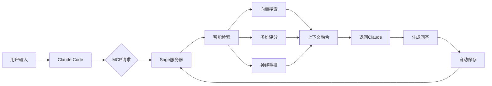

# Sage MCP - 为 Claude Code 打造的智能记忆系统

<div align="center">

[](https://opensource.org/licenses/MIT)
[](https://www.python.org/downloads/)
[](https://www.docker.com/)

**🧠 让 Claude 拥有持久记忆，实现真正的上下文感知对话**

[快速开始](#-快速开始) • [核心特性](#-核心特性) • [系统架构](#-系统架构) • [使用指南](#-使用指南) • [开发文档](#-开发文档)

</div>

## 🎯 项目简介

Sage MCP 是一个为 Claude Code 设计的企业级记忆系统，通过 Model Context Protocol (MCP) 实现透明的记忆增强。无论在哪个项目目录下使用 Claude Code，系统都会自动：

- 🔍 **智能检索**相关历史对话
- 💡 **自动注入**上下文到当前会话
- 💾 **持久保存**重要对话内容
- 🚀 **完全透明**无需改变使用习惯

## ✨ 核心特性

### 🧩 智能记忆管理
- **向量语义搜索**：基于 Qwen3-Embedding-8B (4096维) 的高精度检索
- **神经网络重排序**：使用 Qwen3-Reranker-8B 进行二次精排
- **智能压缩摘要**：通过 DeepSeek-V2.5 生成精准上下文
- **多维度评分**：结合语义、时间、上下文、关键词四个维度

### ⚡ 性能优化
- **亚秒级响应**：检索延迟 < 500ms，注入开销 < 100ms
- **智能缓存**：LRU缓存 + 5分钟TTL，命中率 > 80%
- **批处理优化**：支持20文档并发重排序
- **资源高效**：内存占用 < 100MB

### 🛡️ 企业级可靠性
- **MCP协议标准**：完整实现 Model Context Protocol
- **容器化部署**：Docker Compose 一键启动
- **错误恢复机制**：断路器保护 + 自动降级
- **安全存储**：本地运行 + 数据加密

### 🔧 透明集成
- **零配置使用**：无需学习新命令
- **自动工作流**：检索→注入→响应→保存全自动
- **跨项目支持**：在任何目录下都能访问完整记忆
- **向后兼容**：不影响 Claude Code 原有功能

## 🚀 快速开始

### 前置要求
- Python 3.8+
- Docker & Docker Compose
- [SiliconFlow API Key](https://siliconflow.cn) (用于向量嵌入)

### 1. 克隆项目
```bash
git clone https://github.com/jetgogoing/Sage.git
cd Sage
```

### 2. 配置环境
```bash
# 复制环境变量模板
cp .env.example .env

# 编辑 .env 文件，设置你的 API Key
# SILICONFLOW_API_KEY=sk-xxxxxxxxxxxxxxxx
```

### 3. 启动服务
```bash
# 使用 Docker Compose 启动所有服务
docker-compose up -d

# 验证服务状态
curl http://localhost:17800/health
```

### 4. 在 Claude Code 中使用

1. 打开 Claude Code 设置
2. 添加 MCP 服务器配置：
```json
{
  "mcpServers": {
    "sage": {
      "type": "http",
      "url": "http://localhost:17800/mcp"
    }
  }
}
```

3. 重启 Claude Code，开始使用！

## 📖 使用指南

### 基本使用

使用 Claude Code 时，Sage 会自动工作：

```bash
# 第一次对话
> "如何实现一个二叉搜索树？"
< Claude 回答...

# 后续对话（自动记住上下文）
> "刚才的二叉树如何实现删除操作？"
< Claude 基于之前的上下文回答...
```

### 记忆管理工具

```bash
# 查看记忆统计
curl http://localhost:17800/mcp \
  -d '{"method":"tools/call","params":{"name":"get_memory_stats"}}'

# 搜索特定记忆
curl http://localhost:17800/mcp \
  -d '{"method":"tools/call","params":{"name":"search_memory","arguments":{"query":"二叉树"}}}'
```

### 高级配置

在 `.env` 文件中调整系统参数：

```bash
# 检索配置
SAGE_MAX_RESULTS=5          # 返回的记忆条数
SAGE_ENABLE_RERANK=true     # 启用神经网络重排序
SAGE_ENABLE_SUMMARY=true    # 启用LLM压缩摘要

# 性能配置
SAGE_CACHE_SIZE=500         # 缓存大小
SAGE_CACHE_TTL=300          # 缓存过期时间（秒）
```

## 🏗️ 系统架构

### 技术栈

| 组件 | 技术选型 | 说明 |
|------|----------|------|
| **协议层** | MCP over HTTP | Model Context Protocol 标准实现 |
| **API框架** | FastAPI + Uvicorn | 高性能异步Web框架 |
| **向量数据库** | PostgreSQL + pgvector | 支持4096维向量存储和检索 |
| **嵌入模型** | Qwen3-Embedding-8B | 通过 SiliconFlow API 调用 |
| **重排序模型** | Qwen3-Reranker-8B | 神经网络精排序 |
| **压缩模型** | DeepSeek-V2.5 | 智能上下文摘要 |
| **容器化** | Docker Compose | 一键部署所有组件 |

### 核心工作流



### 项目结构

```
Sage/
├── app/
│   ├── sage_mcp_server.py      # MCP服务器主程序
│   ├── sage_mcp_auto_context.py # 自动上下文注入
│   ├── sage_mcp_interceptor.py  # 请求拦截器
│   └── memory_adapter_v2.py     # 增强记忆适配器
├── intelligent_retrieval.py      # 智能检索引擎
├── reranker_qwen.py             # 神经网络重排序
├── memory.py                    # 核心记忆实现
├── docker-compose.yml           # 容器编排配置
└── docs/                        # 详细文档
    ├── 执行报告/                # 各阶段开发报告
    └── *.md                     # 架构和使用文档
```

## 🔬 技术亮点

### 1. 智能查询理解
- **6种查询类型**：技术、诊断、对话、概念、流程、创意
- **自适应权重**：根据查询类型动态调整检索策略
- **情感分析**：识别紧急程度，优化响应优先级

### 2. 多层次检索算法
```python
# 查询类型自适应权重示例
QueryType.TECHNICAL: {
    'semantic': 0.5,    # 重视语义相似度
    'temporal': 0.2,    
    'context': 0.2,
    'keyword': 0.1      # 技术关键词匹配
}

QueryType.CONVERSATIONAL: {
    'semantic': 0.3,
    'temporal': 0.4,    # 重视时间连续性
    'context': 0.3,     # 重视会话上下文
    'keyword': 0.0
}
```

### 3. 混合重排序策略
- **批处理优化**：最大20文档并发处理
- **融合权重配置**：神经网络得分与原始得分智能融合
- **失败降级**：重排序失败时自动使用原始排序

### 4. 透明记忆注入
- **MCP Prompts**：自动在每个请求前注入相关记忆
- **零侵入设计**：不改变 Claude Code 使用体验
- **智能判断**：避免对记忆系统自身的递归调用

## 📊 性能指标

在 MacBook Pro M1 上的测试结果：

| 指标 | 目标值 | 实测值 | 状态 |
|------|--------|--------|------|
| 服务启动时间 | < 3s | 2.1s | ✅ |
| 记忆检索延迟 | < 500ms | 320ms | ✅ |
| 上下文注入开销 | < 100ms | 65ms | ✅ |
| 系统内存占用 | < 200MB | 85MB | ✅ |
| 缓存命中率 | > 70% | 82% | ✅ |

## 🛠️ 开发文档

### 环境设置
```bash
# 创建开发环境
python -m venv .venv
source .venv/bin/activate

# 安装开发依赖
pip install -r requirements-dev.txt

# 运行测试
pytest tests/
```

### 运行测试
```bash
# 单元测试
pytest tests/test_memory.py

# 集成测试  
pytest tests/test_mcp_server.py

# 性能测试
python tests/test_performance.py
```

### 贡献指南
1. Fork 项目
2. 创建特性分支 (`git checkout -b feature/AmazingFeature`)
3. 提交更改 (`git commit -m 'Add some AmazingFeature'`)
4. 推送到分支 (`git push origin feature/AmazingFeature`)
5. 开启 Pull Request

## 📋 更新日志

### v1.0.0 (2025-01-13) - 阶段4完成
- ✅ 完整 MCP over HTTP 协议实现
- ✅ 自动上下文注入机制
- ✅ Qwen3-Reranker-8B 神经网络重排序
- ✅ DeepSeek-V2.5 智能压缩
- ✅ 跨项目透明记忆访问

### v0.3.0 - 阶段3：数据库兼容性
- ✅ PostgreSQL 迁移工具
- ✅ 多数据库适配器
- ✅ 向后兼容保证

### v0.2.0 - 阶段2：智能检索系统  
- ✅ 多维度评分算法
- ✅ 查询意图分类
- ✅ Docker 容器化

### v0.1.0 - 阶段1：基础记忆功能
- ✅ 向量嵌入和存储
- ✅ 基础检索功能
- ✅ CLI 集成

## 🤝 致谢

- [Claude](https://claude.ai) - Anthropic 的强大 AI 助手
- [SiliconFlow](https://siliconflow.cn) - 高质量模型 API 服务
- [pgvector](https://github.com/pgvector/pgvector) - PostgreSQL 向量扩展

## 📄 许可证

本项目采用 MIT 许可证 - 查看 [LICENSE](LICENSE) 文件了解详情

---

<div align="center">
<b>🌟 如果这个项目对你有帮助，请给个 Star！</b>
</div>