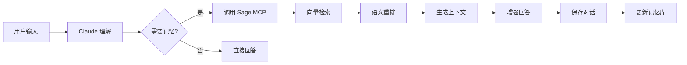

# Sage MCP - 数字化的智慧之殿

<div align="center">

[](https://opensource.org/licenses/MIT)
[](https://www.python.org/downloads/)
[](https://www.docker.com/)
[](https://github.com/jetgogoing/Sage/releases)

**🧠 让 Claude 成为真正的 Sage - 一个拥有永恒记忆的数字哲人**

[开发哲学](#-开发哲学) • [快速开始](#-快速开始) • [核心特性](#-核心特性) • [部署指南](#-部署指南) • [使用方法](#-使用方法)

</div>

## 🏛️ 开发哲学

> *"认识你自己"* - 德尔斐神谕
>
> *"学习即回忆"* - 柏拉图

在古希腊哲学传统中，**Sage（σοφός）** 不仅是智者，更是能够穿越时间、积累智慧、理解万物本质的哲人。正如柏拉图在《美诺篇》中所述，真正的知识并非从外部获得，而是灵魂对永恒理念的**回忆（Anamnesis）**。

Sage MCP 正是这一古老智慧在数字时代的化身。它不是简单的存储系统，而是一个能够：

- **📜 永恒记忆**：如同哲人的智慧穿越时空，每一次对话都成为永恒知识的一部分
- **🔮 深层理解**：通过语义向量捕捉概念的本质，而非表象的文字
- **💭 智慧回忆**：不是机械检索，而是如同灵魂唤醒沉睡记忆般的智能召回
- **🌟 不断进化**：每次交互都在丰富这个数字化的智慧之源

正如赫拉克利特所言：*"智慧在于理解所有事物如何被引导通过所有事物"*。Sage 通过向量空间中的语义关联，实现了这种万物相通的智慧连接。

## 🎯 项目简介

Sage MCP 是一个为 Claude Code CLI 设计的记忆增强系统，通过 Model Context Protocol (MCP) 让 Claude 能够：

- 🔄 **持久保存**对话历史
- 🔍 **智能检索**相关记忆
- 🧩 **语义理解**基于向量的相似度搜索
- 🚀 **无缝集成**自动启动，透明运行

## ✨ 核心特性

### 🧩 智能记忆管理
- **向量语义搜索**：基于 SiliconFlow API 的 4096 维高精度向量嵌入
- **智能检索算法**：多维度评分（语义相似度、时间权重、上下文相关性）
- **会话管理**：支持多会话隔离和标签系统
- **数据持久化**：PostgreSQL + pgvector 保证数据安全

### 🏗️ 技术架构

### 📐 整体架构设计
Sage MCP 采用分层架构设计，确保各组件职责清晰、高内聚低耦合：

```
┌─────────────────────────────────────────────────────────────┐
│                   Claude Code CLI                           │
│                     (用户界面)                               │
└─────────────────────┬───────────────────────────────────────┘
                      │ MCP STDIO Protocol
┌─────────────────────▼───────────────────────────────────────┐
│                  MCP Protocol 层                           │
│              sage_mcp_stdio_single.py                      │
│          (5个核心工具：S, get_context 等)                   │
└─────────────────────┬───────────────────────────────────────┘
                      │ Direct API Calls
┌─────────────────────▼───────────────────────────────────────┐
│                  Sage Core 层                              │
│              (singleton_manager 管理)                      │
│    ┌─────────────┐  ┌─────────────┐  ┌─────────────┐      │
│    │MemoryManager│  │SessionManager│  │ConfigManager│      │
│    └─────────────┘  └─────────────┘  └─────────────┘      │
└─────────────────────┬───────────────────────────────────────┘
                      │ Database Connections
┌─────────────────────▼───────────────────────────────────────┐
│                   存储层                                    │
│          PostgreSQL 15 + pgvector                          │
│       (memories表 + sessions表 + 向量索引)                  │
└─────────────────────────────────────────────────────────────┘
```

### 🔗 Hooks与Sage Core协作机制

**协作流程**：
1. **Hook触发**：Claude CLI在特定事件时调用Hook脚本
2. **数据聚合**：HookDataAggregator收集完整的Turn数据
3. **直接初始化**：绕过复杂daemon，直接调用get_sage_core()
4. **数据保存**：通过MemoryManager保存到PostgreSQL
5. **事务保证**：TransactionManager确保数据一致性

**核心Hook脚本**：
- `sage_stop_hook_simple.py`：简化版停止Hook，负责保存对话数据
- `HookDataAggregator`：智能数据聚合器，整合用户输入和工具调用
- 支持完整的Turn和ToolCall追踪，包含执行时间和状态

### 🐳 容器化架构
- **单容器设计**：PostgreSQL + Python应用集成在一个容器内
- **智能启动**：entrypoint.sh处理服务编排和依赖关系
- **数据持久化**：本地目录绑定策略，数据安全可控
- **时区支持**：默认北京时间，全球时区可配置

### 🔬 技术亮点

#### 1. 智能查询理解
```python
# 自动识别查询意图
"最近的对话" → 时间排序
"相关的讨论" → 语义相似度
"关于API的" → 关键词匹配
```

#### 2. 多阶段检索
```
查询 → 向量检索(Top 20) → 重排序(Top 10) → 上下文生成
      ↓                    ↓                  ↓
   语义相似度          综合评分           LLM 压缩
```

#### 3. 工作流程图


## 🚀 快速开始

### 方式一：一键部署（推荐）

#### 前置要求
1. **Docker Desktop**（必需）
   - macOS: [下载 Docker Desktop](https://www.docker.com/products/docker-desktop/)
   - Windows: 需要 WSL2
   - Linux: Docker Engine

2. **Claude Code CLI**（必需）
   ```bash
   npm install -g claude-code
   ```

3. **SiliconFlow API Key**（必需）
   - 访问 [https://siliconflow.cn](https://siliconflow.cn)
   - 注册并获取 API Key

#### 一键部署

```bash
# 1. 克隆项目
git clone https://github.com/jetgogoing/Sage.git
cd Sage

# 2. 环境检查（可选）
./scripts/check_environment.sh

# 3. 配置环境变量
cp .env.example .env
# 编辑 .env 文件，填入你的 API Key

# 4. 一键部署
./deploy.sh
```

**部署选项：**
- `./deploy.sh` - 标准部署
- `./deploy.sh --backup` - 带数据备份的部署
- `./deploy.sh --force-rebuild` - 强制重新构建镜像
- `./deploy.sh --cleanup` - 清理并重新部署
- `./deploy.sh --quick` - 快速部署（跳过部分检查）

#### 5. 启动使用

```bash
# 启动 Claude CLI
claude
```

### 方式二：手动部署

#### 1. 克隆项目

```bash
git clone https://github.com/jetgogoing/Sage.git
cd Sage
```

#### 2. 配置环境变量

```bash
# 复制环境变量模板
cp .env.example .env

# 编辑 .env 文件，填入你的 API Key
# SILICONFLOW_API_KEY=sk-你的真实密钥
```

或者直接设置环境变量：
```bash
export SILICONFLOW_API_KEY="sk-你的真实密钥"
```

#### 3. 配置 MCP

项目已包含 `.mcp.json` 配置文件：
```json
{
  "mcpServers": {
    "sage": {
      "type": "stdio",
      "command": "./scripts/sage_mcp_stdio_wrapper.sh",
      "args": []
    }
  }
}
```

#### 4. 手动启动容器

```bash
# 确保 Docker 正在运行
docker info

# 构建和启动容器
docker-compose up --build -d

# 启动 Claude CLI
claude
```

### 部署验证

首次运行时会自动：
- 构建 Docker 镜像（约 2-3 分钟）
- 创建数据库
- 初始化向量扩展
- 执行健康检查

## 🔗 Hooks配置指南

Sage的Hook系统能够自动捕获Claude Code CLI的对话数据并保存到记忆系统。以下是详细的配置步骤：

### 📋 Hook系统工作原理

```
Claude CLI 对话 → Hook触发 → 数据捕获 → SageCore初始化 → 数据库保存
     ↓              ↓           ↓             ↓              ↓
  用户交互     PreToolUse   工具调用数据   MemoryManager   PostgreSQL
             PostToolUse   对话内容     TransactionManager
             Stop Hook     聚合数据     向量化处理
```

### 🔧 macOS Hooks配置

#### 步骤1：检查Claude Code CLI配置目录
```bash
# 检查配置目录是否存在
ls -la ~/.config/claude/

# 如果不存在，创建目录
mkdir -p ~/.config/claude/
```

#### 步骤2：配置Hooks文件
```bash
# 方式一：直接复制预配置文件（推荐）
cp /Users/jet/Sage/hooks/new_hooks.json ~/.config/claude/hooks.json

# 方式二：手动创建配置文件
cat > ~/.config/claude/hooks.json << 'EOF'
{
  "hooks": {
    "PreToolUse": [
      {
        "hooks": [
          {
            "type": "command",
            "command": "python3 /Users/jet/Sage/hooks/scripts/sage_pre_tool_capture.py",
            "timeout": 5000,
            "env": {
              "SAGE_HOOK_ENABLED": "true",
              "CLAUDE_CODE_HOOK_EVENT": "PreToolUse"
            }
          }
        ]
      }
    ],
    "PostToolUse": [
      {
        "hooks": [
          {
            "type": "command",
            "command": "python3 /Users/jet/Sage/hooks/scripts/sage_post_tool_capture.py",
            "timeout": 5000,
            "env": {
              "SAGE_HOOK_ENABLED": "true",
              "CLAUDE_CODE_HOOK_EVENT": "PostToolUse"
            }
          }
        ]
      }
    ],
    "Stop": [
      {
        "hooks": [
          {
            "type": "command",
            "command": "python3 /Users/jet/Sage/hooks/scripts/sage_stop_hook_simple.py",
            "timeout": 10000,
            "env": {
              "SAGE_HOOK_ENABLED": "true",
              "CLAUDE_CODE_HOOK_EVENT": "Stop"
            }
          }
        ]
      }
    ]
  }
}
EOF
```

#### 步骤3：设置脚本权限
```bash
# 确保Hook脚本有执行权限
chmod +x /Users/jet/Sage/hooks/scripts/*.py
```

#### 步骤4：验证配置
```bash
# 检查配置文件
cat ~/.config/claude/hooks.json

# 测试Hook脚本
python3 /Users/jet/Sage/hooks/scripts/sage_stop_hook_simple.py --test
```

### 🪟 Windows Hooks配置

#### 步骤1：检查Claude Code CLI配置目录
```powershell
# 检查配置目录（PowerShell）
Test-Path "$env:USERPROFILE\.config\claude"

# 如果不存在，创建目录
New-Item -Path "$env:USERPROFILE\.config\claude" -ItemType Directory -Force
```

#### 步骤2：Windows路径适配
```powershell
# 获取Sage项目路径（假设在 C:\Users\YourUser\dev\Sage）
$SagePath = "C:\Users\$env:USERNAME\dev\Sage"

# 创建hooks.json配置文件
$HooksConfig = @"
{
  "hooks": {
    "PreToolUse": [
      {
        "hooks": [
          {
            "type": "command",
            "command": "python $SagePath\\hooks\\scripts\\sage_pre_tool_capture.py",
            "timeout": 5000,
            "env": {
              "SAGE_HOOK_ENABLED": "true",
              "CLAUDE_CODE_HOOK_EVENT": "PreToolUse"
            }
          }
        ]
      }
    ],
    "PostToolUse": [
      {
        "hooks": [
          {
            "type": "command",
            "command": "python $SagePath\\hooks\\scripts\\sage_post_tool_capture.py",
            "timeout": 5000,
            "env": {
              "SAGE_HOOK_ENABLED": "true",
              "CLAUDE_CODE_HOOK_EVENT": "PostToolUse"
            }
          }
        ]
      }
    ],
    "Stop": [
      {
        "hooks": [
          {
            "type": "command",
            "command": "python $SagePath\\hooks\\scripts\\sage_stop_hook_simple.py",
            "timeout": 10000,
            "env": {
              "SAGE_HOOK_ENABLED": "true",
              "CLAUDE_CODE_HOOK_EVENT": "Stop"
            }
          }
        ]
      }
    ]
  }
}
"@

# 保存配置文件
$HooksConfig | Out-File -FilePath "$env:USERPROFILE\.config\claude\hooks.json" -Encoding UTF8
```

#### 步骤3：Python环境检查
```powershell
# 验证Python安装
python --version

# 验证必要模块
python -c "import sys, os; print('Python path:', sys.executable)"

# 测试Hook脚本路径
Test-Path "$SagePath\hooks\scripts\sage_stop_hook_simple.py"
```

#### 步骤4：Windows特殊配置
```powershell
# 如果使用虚拟环境，需要更新Python路径
# 假设虚拟环境在 C:\Users\YourUser\sage_env
$VenvPython = "C:\Users\$env:USERNAME\sage_env\Scripts\python.exe"

# 更新hooks.json中的python命令为完整路径
# 将所有 "python" 替换为 $VenvPython
```

### 🔄 Hook系统工作流程详解

#### Hook触发时机
1. **PreToolUse**: 在Claude调用任何工具之前触发
2. **PostToolUse**: 在每个工具调用完成后触发  
3. **Stop**: 在整个对话结束时触发

#### 数据捕获机制
```python
# PreToolUse Hook 捕获
{
    "tool_name": "工具名称",
    "tool_input": "工具输入参数",
    "timestamp": "时间戳"
}

# PostToolUse Hook 捕获
{
    "tool_name": "工具名称", 
    "tool_output": "工具输出结果",
    "execution_time": "执行时间",
    "status": "success/error"
}

# Stop Hook 整合
{
    "user_prompt": "用户输入",
    "assistant_response": "助手回复",
    "tool_calls": [...], // 所有工具调用
    "session_id": "会话ID",
    "turn_id": "对话轮次ID"
}
```

### ⚙️ Hook配置参数说明

#### 超时设置
- **PreToolUse/PostToolUse**: 5000ms (5秒)
- **Stop Hook**: 10000ms (10秒) - 需要初始化SageCore

#### 环境变量
- `SAGE_HOOK_ENABLED`: 启用/禁用Hook功能
- `CLAUDE_CODE_HOOK_EVENT`: Hook事件类型标识

#### 临时文件位置
- **macOS**: `~/.sage_hooks_temp/`
- **Windows**: `%USERPROFILE%\.sage_hooks_temp\`

### 🧪 Hook配置测试

#### 测试脚本
```bash
# macOS测试
python3 /Users/jet/Sage/scripts/test_simplified_system.py

# Windows测试  
python C:\Users\YourUser\dev\Sage\scripts\test_simplified_system.py
```

#### 手动测试流程
1. **启动Sage MCP服务**
   ```bash
   cd /path/to/Sage
   docker-compose up -d
   ```

2. **启动Claude CLI**
   ```bash
   claude
   ```

3. **执行测试对话**
   ```text
   # 在Claude CLI中输入
   测试Hook系统，请使用一个工具然后结束对话
   ```

4. **检查日志**
   ```bash
   # macOS
   tail -f /Users/jet/Sage/hooks/logs/*.log
   
   # Windows
   Get-Content "C:\Users\YourUser\dev\Sage\hooks\logs\*.log" -Wait
   ```

### 🔧 常见问题排查

#### 1. Hook未触发
```bash
# 检查配置文件格式
python -m json.tool ~/.config/claude/hooks.json

# 检查脚本权限
ls -la /path/to/Sage/hooks/scripts/
```

#### 2. Python路径问题
```bash
# macOS - 检查Python路径
which python3

# Windows - 检查Python路径  
where python
```

#### 3. 权限问题
```bash
# macOS - 修复权限
chmod +x /Users/jet/Sage/hooks/scripts/*.py

# Windows - 以管理员身份运行PowerShell
```

#### 4. 超时问题
```json
// 增加超时时间（毫秒）
"timeout": 15000  // 15秒
```

### 📊 Hook性能调优

#### 优化建议
- **缓存启用**: Hook配置中启用缓存减少重复初始化
- **日志级别**: 生产环境设置为INFO或WARNING
- **临时文件清理**: 定期清理临时目录

#### 监控指标
- Hook执行时间：正常情况下<10秒
- 数据保存成功率：应>95%
- 临时文件清理：自动清理机制

### 🎯 Hook系统优势

#### 简化架构优势
- ✅ **无daemon进程**: 避免进程管理复杂性
- ✅ **完整数据捕获**: 包含所有工具调用和对话内容
- ✅ **统一数据模型**: Turn模型表示完整对话轮次
- ✅ **自动数据聚合**: 智能整合pre/post工具调用数据
- ✅ **高度可靠**: 每次调用都是独立的，不依赖外部进程

#### 适用场景
- **个人使用**: 完美适配个人开发和学习场景
- **轻量部署**: 无需复杂的进程管理和监控
- **快速上手**: 配置简单，易于理解和维护

## 📚 使用方法

### 基础命令

在 Claude CLI 中使用以下自然语言：

```text
# 保存对话
保存这段对话

# 搜索记忆
搜索关于 Docker 的记忆

# 查看所有工具
What tools are available?
```

## 🛠️ Sage MCP 工具详解

Sage MCP 提供5个核心工具，每个工具都经过精心设计以支持不同的记忆管理场景：

### 📝 S - 对话保存工具
**功能**：保存用户和助手的完整对话到记忆系统
**输入参数**：
- `user_prompt` (必需)：用户的输入内容
- `assistant_response` (必需)：助手的回复内容  
- `metadata` (可选)：额外的元数据信息

**使用场景**：
```text
# 基础保存
S

# 手动保存对话
保存这段对话

# 带标签保存
保存当前对话，标记为"重要讨论"
```

**技术实现**：
- 自动生成4096维语义向量
- 支持事务性保存，确保数据一致性
- 自动关联当前会话ID

### 🔍 get_context - 智能上下文检索
**功能**：根据查询获取相关的历史上下文信息
**输入参数**：
- `query` (必需)：查询内容
- `max_results` (可选)：最大返回结果数，默认10条

**使用场景**：
```text
# 语义搜索
获取关于Python装饰器的相关上下文

# 技术问题检索
查找之前讨论过的数据库优化方案

# 项目相关查询
获取与当前项目架构相关的历史讨论
```

**检索策略**：
- 多维度评分：语义相似度(50%) + 时间权重(20%) + 上下文相关性(20%) + 关键词匹配(10%)
- 向量检索 → 重排序 → LLM压缩的三阶段流程
- 自动识别查询类型，动态调整权重

### 🗂️ manage_session - 会话管理中心
**功能**：创建、切换、查看会话信息
**输入参数**：
- `action` (必需)：操作类型 - create/switch/info/list
- `session_id` (条件必需)：会话ID，用于switch和info操作

**使用场景**：
```text
# 创建新会话
创建新会话进行独立项目讨论

# 切换会话
切换到之前的Python学习会话

# 查看会话信息
显示当前会话详情

# 列出所有会话
列出我的所有会话
```

**会话隔离机制**：
- 每个会话独立的记忆空间
- 支持会话级别的标签和元数据
- 自动追踪最后活跃时间

### 💡 generate_prompt - 智能提示生成器
**功能**：基于上下文生成智能提示和建议
**输入参数**：
- `context` (必需)：上下文信息
- `style` (可选)：提示风格 - default/question/suggestion

**使用场景**：
```text
# 学习路径建议
根据我的学习历史，建议下一步学习内容

# 问题深化
基于当前讨论，生成进一步的思考问题

# 项目建议
根据项目历史，提供优化建议
```

**智能生成策略**：
- 分析历史模式识别兴趣点
- 自适应用户学习进度
- 支持多种输出风格

### 📊 get_status - 服务状态监控
**功能**：获取Sage服务的运行状态和统计信息
**输入参数**：无

**使用场景**：
```text
# 健康检查
检查Sage服务状态

# 统计信息
显示记忆数量和服务运行时间

# 性能监控
查看系统资源使用情况
```

**监控指标**：
- 数据库连接状态
- 记忆总数和会话数量
- 服务运行时长和健康状态
- 缓存命中率和性能指标

### 🎯 工具使用最佳实践

**记忆管理工作流**：
```text
1. 创建专题会话 → manage_session (action: create)
2. 进行专题讨论 → 自动Hook捕获或手动 S
3. 查找相关历史 → get_context (query: 相关主题)
4. 获取学习建议 → generate_prompt (context: 学习进度)
5. 监控系统状态 → get_status
```

**高效搜索技巧**：
- 使用具体的技术术语提高精确度
- 结合时间范围："最近关于API设计的讨论"
- 多关键词组合："Python 异步编程 最佳实践"
- 问题导向搜索："如何解决内存泄漏问题"

### 高级用法

#### 智能场景识别
Sage 会自动识别您的工作场景并调整策略：

```text
# 编程场景 - 自动强调代码示例和技术细节
用户：如何实现一个装饰器？
Sage：[识别编程场景，提供代码示例和之前的相关讨论]

# 调试场景 - 自动关联错误模式和解决方案
用户：TypeError: 'NoneType' object is not subscriptable
Sage：[识别调试场景，提供类似错误的历史解决方案]

# 学习场景 - 自动构建知识路径
用户：我想学习机器学习
Sage：[识别学习场景，提供系统化的学习路径和历史进度]
```

#### 手动保存对话
```text
# 为重要对话添加描述性标题
保存我们刚才的讨论，标记为"架构设计-微服务拆分方案"
```

#### 高效搜索技巧
```text
# 搜索特定内容
搜索所有关于 API 设计的历史对话

# 多关键词搜索（空格分隔）
搜索 Python 装饰器 高级用法

# 短语搜索（使用引号）
搜索 "二叉搜索树删除"
```

#### 导出记忆
```text
# 导出为 markdown 格式
将今天的所有对话导出为 markdown 格式

# 导出特定会话
导出当前会话的所有对话
```

#### 记忆管理最佳实践
```text
# 查看系统状态
获取 Sage 服务状态

# 分析记忆模式
分析我的记忆模式

# 创建新会话
创建新会话进行独立项目讨论
```

## 🔧 配置说明

### 环境变量

必需配置：
- `SILICONFLOW_API_KEY`: 用于向量嵌入的 API Key

可选配置：
```bash
# 记忆检索配置
SAGE_MAX_RESULTS=5               # 返回结果数量
SAGE_SIMILARITY_THRESHOLD=0.5    # 相似度阈值

# 性能配置
SAGE_CACHE_SIZE=500              # 缓存大小
SAGE_CACHE_TTL=300               # 缓存过期时间（秒）

# 日志配置
SAGE_DEBUG=false                 # 调试模式
SAGE_LOG_LEVEL=INFO              # 日志级别
```

### Docker 配置

数据持久化：
- 数据库：`sage-mcp-data` volume
- 日志：`sage-mcp-logs` volume

### 时区设置

默认使用北京时间（UTC+8）。如需修改，编辑：
- `docker/single/Dockerfile.single.minimal` - 修改 `TZ` 环境变量
- `docker/single/entrypoint.sh` - 修改 PostgreSQL 时区配置

## 🎨 高级配置

### 自定义配置文件

在 `.env` 文件中可以配置以下高级选项：

```bash
# 检索算法配置
SAGE_ENABLE_RERANK=true          # 启用神经网络重排序
SAGE_ENABLE_SUMMARY=true         # 启用LLM压缩摘要
SAGE_SIMILARITY_THRESHOLD=0.5    # 语义相似度阈值

# 查询类型权重（自动识别场景）
SAGE_QUERY_WEIGHTS='{"technical": {"semantic": 0.5, "temporal": 0.2, "context": 0.2, "keyword": 0.1}}'

# 预留配置（未来版本）
SAGE_TRANSPARENT_MODE=false      # 透明记忆模式
SAGE_MODE_ON=false               # 智能模式
```

### 性能优化技巧

```bash
# 增加返回结果数
export SAGE_MAX_RESULTS=10

# 增大缓存提高响应速度
export SAGE_CACHE_SIZE=1000

# 关闭重排序以提速（牺牲精度）
export SAGE_ENABLE_RERANK=false
```

## 🛠️ 开发指南

### 管理命令

```bash
# 环境检查
./scripts/check_environment.sh

# 健康检查
./scripts/health_check.sh

# 性能测试
./scripts/performance_test.sh

# 集成测试
./scripts/integration_test.sh

# 实时监控
./scripts/monitor.sh

# 一键部署
./deploy.sh
```

### 容器管理

```bash
# 查看容器状态
docker-compose ps

# 重启服务
docker-compose restart

# 停止服务
docker-compose down

# 查看日志
docker-compose logs -f
```

### 重建镜像

```bash
# 强制重新构建
./deploy.sh --force-rebuild

# 或手动重建
docker-compose down
docker-compose build --no-cache
docker-compose up -d
```

### 数据库操作

```bash
# 进入数据库
docker exec -it sage-mcp psql -U sage -d sage_memory

# 查看记忆
SELECT id, user_input, created_at FROM memories ORDER BY created_at DESC LIMIT 10;

# 数据备份
docker exec sage-mcp pg_dump -U sage sage_memory > backup_$(date +%Y%m%d).sql

# 数据恢复
cat backup_20240101.sql | docker exec -i sage-mcp psql -U sage -d sage_memory
```

### 监控和调试

```bash
# 实时监控容器状态
./scripts/monitor.sh --dashboard

# 查看详细健康状态
./scripts/health_check.sh --json

# 性能基准测试
./scripts/performance_test.sh --report

# 完整集成测试
./scripts/integration_test.sh --cleanup
```

### 清理数据

```bash
# 安全清理（保留数据）
docker-compose down

# 完全清理（删除数据）
./deploy.sh --cleanup
docker volume rm sage-data sage-logs

# 清理镜像
docker rmi sage-mcp:latest
```

## 💡 使用技巧

### 高级提示词技巧

1. **上下文增强提示词**
   ```
   基于我们之前关于[主题]的讨论，请深入讲解[具体问题]
   ```

2. **知识连接提示词**
   ```
   结合我之前学习的[知识点A]和[知识点B]，解释[新概念]
   ```

3. **问题解决提示词**
   ```
   我之前遇到过类似的[问题类型]，这次的[具体问题]应该如何解决？
   ```

4. **学习路径提示词**
   ```
   根据我的学习历史，下一步我应该学习什么来掌握[目标技能]？
   ```

### 批量操作脚本

```bash
#!/bin/bash
# 批量导出所有会话
sessions=$(docker exec sage-mcp psql -U sage -d sage_memory -t -c "SELECT id FROM sessions")
for session in $sessions; do
    echo "Exporting session: $session"
    # 使用 Sage 工具导出
done
```

## ❓ 常见问题

### 1. Docker 未运行
**错误**：`Docker daemon 未运行`
**解决**：启动 Docker Desktop

### 2. API Key 未设置
**错误**：`SILICONFLOW_API_KEY 环境变量未设置`
**解决**：
- 检查 `.env` 文件
- 或设置环境变量：`export SILICONFLOW_API_KEY="sk-xxx"`

### 3. 容器启动失败
**排查步骤**：
```bash
# 查看容器状态
docker ps -a | grep sage

# 查看错误日志
docker logs sage-mcp
```

### 4. 记忆未保存
**原因**：当前版本需要手动保存
**解决**：使用"保存对话"命令

### 5. 构建速度慢
**解决**：
- 使用国内 Docker 镜像源
- 确保网络连接稳定

### 6. Connection reset by peer 错误
**症状**：Docker 容器运行正常，但仍然报连接错误
**解决方案**：
```bash
# 使用健康检查工具诊断
./scripts/health_check.sh

# 查看详细日志
docker-compose logs sage-mcp

# 重启服务
docker-compose restart
```

### 7. 部署失败
**诊断工具**：
```bash
# 环境检查
./scripts/check_environment.sh --fix

# 集成测试
./scripts/integration_test.sh

# 查看部署日志
tail -f deploy.log
```

### 8. 性能问题
**监控工具**：
```bash
# 实时监控
./scripts/monitor.sh --alerts

# 性能测试
./scripts/performance_test.sh --concurrent 10

# 资源使用分析
docker stats sage-mcp
```

### 9. 服务管理
**管理命令**：
```bash
# 服务状态
./scripts/health_check.sh

# 重启服务
docker-compose restart

# 查看进程
docker exec sage-mcp supervisorctl status
```

## 🗄️ 数据库结构详解

### 📊 PostgreSQL + pgvector 架构
Sage使用PostgreSQL 15作为数据存储后端，集成pgvector扩展支持高维向量存储和相似度搜索。

### 📋 核心数据表

#### 1. memories 表 - 记忆存储
```sql
CREATE TABLE memories (
    id UUID PRIMARY KEY DEFAULT gen_random_uuid(),
    session_id VARCHAR(255),                      -- 会话隔离
    user_input TEXT NOT NULL,                     -- 用户输入
    assistant_response TEXT NOT NULL,             -- 助手响应
    embedding vector(4096),                       -- 4096维语义向量
    metadata JSONB DEFAULT '{}',                  -- 扩展元数据
    created_at TIMESTAMP WITH TIME ZONE DEFAULT CURRENT_TIMESTAMP,
    updated_at TIMESTAMP WITH TIME ZONE DEFAULT CURRENT_TIMESTAMP
);

-- 性能优化索引
CREATE INDEX idx_memories_session_id ON memories(session_id);
CREATE INDEX idx_memories_created_at ON memories(created_at DESC);
-- 注意：4096维向量超过pgvector索引限制，使用序列扫描
```

#### 2. sessions 表 - 会话管理
```sql
CREATE TABLE sessions (
    id VARCHAR(255) PRIMARY KEY,                 -- 会话唯一标识
    name VARCHAR(255),                           -- 会话显示名称
    metadata JSONB DEFAULT '{}',                 -- 会话元数据
    created_at TIMESTAMP WITH TIME ZONE DEFAULT CURRENT_TIMESTAMP,
    updated_at TIMESTAMP WITH TIME ZONE DEFAULT CURRENT_TIMESTAMP,
    last_active TIMESTAMP WITH TIME ZONE DEFAULT CURRENT_TIMESTAMP
);

-- 活跃度索引
CREATE INDEX idx_sessions_last_active ON sessions(last_active DESC);
```

### 🔧 数据库特性

**时区感知设计**：
- 所有时间戳使用`TIMESTAMP WITH TIME ZONE`
- 默认北京时间(Asia/Shanghai)
- 自动处理夏令时转换

**向量存储优化**：
- 4096维向量：匹配SiliconFlow API输出
- 避开pgvector 2000维索引限制
- 使用序列扫描配合应用层缓存

**自动更新触发器**：
```sql
-- 自动更新时间戳
CREATE OR REPLACE FUNCTION update_updated_at_column()
RETURNS TRIGGER AS $$
BEGIN
    NEW.updated_at = CURRENT_TIMESTAMP;
    RETURN NEW;
END;
$$ language 'plpgsql';
```

**权限控制**：
- 最小权限原则：sage用户仅能访问必要表
- 扩展权限：支持向量操作和自定义函数
- 连接隔离：容器网络内部访问

## 🐳 跨平台Docker镜像打包指南

### 📦 构建环境要求

#### Windows 环境
```powershell
# 1. 安装Docker Desktop for Windows
# 下载：https://www.docker.com/products/docker-desktop/

# 2. 启用WSL 2 Backend（推荐）
# 设置 → General → Use the WSL 2 based engine

# 3. 验证Docker安装
docker --version
docker-compose --version

# 4. 确保足够的磁盘空间（推荐至少5GB）
```

#### macOS 环境  
```bash
# 1. 安装Docker Desktop for Mac
# 下载：https://www.docker.com/products/docker-desktop/

# 2. 验证安装
docker --version
docker-compose --version

# 3. 配置资源限制（推荐）
# Docker Desktop → Settings → Resources
# Memory: 4GB+, CPU: 2核+
```

#### Linux 环境
```bash
# 1. 安装Docker Engine
curl -fsSL https://get.docker.com -o get-docker.sh
sudo sh get-docker.sh

# 2. 安装Docker Compose
sudo pip3 install docker-compose

# 3. 配置用户权限
sudo usermod -aG docker $USER
newgrp docker
```

### 🔨 镜像构建流程

#### 方式一：一键构建（推荐）
```bash
# 1. 克隆项目
git clone https://github.com/jetgogoing/Sage.git
cd Sage

# 2. 配置环境变量
cp .env.example .env
# 编辑 .env 文件，设置 SILICONFLOW_API_KEY

# 3. 一键部署
./deploy.sh

# 4. 验证构建
docker images | grep sage-mcp
docker-compose ps
```

#### 方式二：手动构建
```bash
# 1. 构建镜像
docker-compose build --no-cache

# 2. 启动服务
docker-compose up -d

# 3. 查看日志
docker-compose logs -f sage-mcp

# 4. 健康检查
docker exec sage-mcp pg_isready -U postgres
```

### 📁 Python依赖安装详解

#### requirements.txt 解析
```text
# MCP协议支持
mcp>=1.1.0                    # Model Context Protocol SDK

# 数据库驱动  
asyncpg>=0.29.0               # PostgreSQL异步驱动

# 科学计算（向量操作）
numpy>=1.24.0                 # 数值计算基础库

# 认证和安全
PyJWT>=2.8.0                  # JWT token处理

# 配置管理
python-dotenv>=1.0.0          # 环境变量加载

# 异步文件操作  
aiofiles>=23.2.1              # 异步文件读写

# HTTP请求
requests>=2.31.0              # 向量化API调用
```

#### 各平台安装指南

**Windows 安装**：
```powershell
# 1. 安装Python 3.10+
# 从Microsoft Store或python.org下载

# 2. 验证安装
python --version
pip --version

# 3. 创建虚拟环境（推荐）
python -m venv sage_env
sage_env\Scripts\activate

# 4. 安装依赖
cd Sage
pip install -r requirements.txt

# 5. 验证安装
python -c "import mcp; print('MCP SDK installed successfully')"
```

**macOS 安装**：
```bash
# 1. 安装Python（通过Homebrew推荐）
brew install python@3.10

# 2. 创建虚拟环境
python3 -m venv sage_env
source sage_env/bin/activate

# 3. 升级pip
pip install --upgrade pip

# 4. 安装依赖
cd Sage
pip install -r requirements.txt

# 5. 验证安装
python -c "import asyncpg; print('PostgreSQL driver ready')"
```

**Linux 安装**：
```bash
# 1. 安装Python和开发工具
sudo apt update
sudo apt install python3.10 python3.10-venv python3-pip
# 或者 CentOS/RHEL: sudo yum install python3 python3-pip

# 2. 创建虚拟环境
python3 -m venv sage_env
source sage_env/bin/activate

# 3. 安装依赖
cd Sage
pip install -r requirements.txt

# 4. 安装系统依赖（如需要）
sudo apt-get install build-essential
```

### 🚀 镜像优化技巧

**多阶段构建**：
```dockerfile
# 优化的Dockerfile示例
FROM python:3.10-slim AS builder
COPY requirements.txt .
RUN pip install --user -r requirements.txt

FROM python:3.10-slim
COPY --from=builder /root/.local /root/.local
# 减少镜像层数和大小
```

**缓存优化**：
```bash
# 使用BuildKit加速构建
export DOCKER_BUILDKIT=1
docker-compose build

# 利用层缓存
docker-compose build --parallel
```

**性能调优**：
```bash
# 调整Docker Desktop资源配置
# Memory: 4GB+ （向量计算需要）
# CPU: 2核+ （PostgreSQL + Python）
# Disk: 20GB+ （数据库数据）
```

## 🏗️ 项目结构

```
sage/
├── .mcp.json                         # MCP 配置文件
├── .env.example                      # 环境变量模板
├── deploy.sh                         # 一键部署脚本
├── docker-compose.yml               # Docker编排配置
├── requirements.txt                  # Python依赖清单
├── scripts/                          # 管理脚本
│   ├── sage_mcp_stdio_wrapper.sh     # MCP启动包装器
│   ├── check_environment.sh          # 环境检查工具
│   ├── health_check.sh              # 健康检查脚本
│   └── monitor.sh                   # 实时监控工具
├── docker/                          # Docker配置
│   └── single/
│       ├── Dockerfile.single.minimal  # 最小化镜像定义
│       ├── entrypoint.sh             # 容器启动脚本
│       └── init.sql                  # 数据库初始化SQL
├── sage_core/                        # 核心功能模块
│   ├── __init__.py                   # 包初始化
│   ├── singleton_manager.py          # 单例管理器
│   ├── memory/                       # 记忆管理
│   │   ├── manager.py                # 记忆管理器
│   │   ├── storage.py                # 存储层
│   │   └── vectorizer.py             # 向量化器
│   ├── database/                     # 数据库操作
│   │   ├── connection.py             # 连接管理
│   │   └── transaction.py            # 事务管理
│   ├── config/                       # 配置管理
│   │   └── manager.py                # 配置管理器
│   ├── interfaces/                   # 接口定义
│   │   ├── memory.py                 # 记忆接口
│   │   └── turn.py                   # 对话轮次模型
│   └── resilience/                   # 容错机制
│       ├── circuit_breaker.py        # 熔断器
│       └── retry_strategy.py         # 重试策略
├── hooks/                            # Hook脚本
│   ├── scripts/
│   │   ├── sage_stop_hook_simple.py  # 简化停止Hook
│   │   └── hook_data_aggregator.py   # 数据聚合器
│   └── configs/
│       └── sage_hooks.json           # Hook配置
├── sage_mcp_stdio_single.py          # MCP服务主文件
├── data/                             # 数据目录
│   ├── postgresql/                   # 数据库数据
│   └── logs/                         # 日志文件
└── docs/                             # 文档目录
    └── 执行报告/                     # 项目报告
```

## 🔐 安全说明

- API Key 请妥善保管，不要提交到代码仓库
- 默认配置仅适用于本地开发
- 生产环境需要额外的安全配置

## 🔬 技术深度

### 查询类型自适应权重

Sage 能够智能识别 6 种查询类型并动态调整检索策略：

```python
# 技术查询 - 重视语义相似度
QueryType.TECHNICAL: {
    'semantic': 0.5,    # 语义匹配优先
    'temporal': 0.2,    
    'context': 0.2,
    'keyword': 0.1      # 技术关键词
}

# 对话查询 - 重视时间连续性
QueryType.CONVERSATIONAL: {
    'semantic': 0.3,
    'temporal': 0.4,    # 时序优先
    'context': 0.3,     # 上下文相关
    'keyword': 0.0
}
```

### 多阶段检索流程

```
查询 → 向量检索(Top 20) → 重排序(Top 10) → 上下文生成
      ↓                    ↓                  ↓
   语义相似度          综合评分           LLM 压缩
```

### 性能基准测试

在 MacBook Pro M1 上的测试结果：

| 指标 | 目标值 | 实测值 | 状态 |
|------|--------|--------|------|
| 服务启动时间 | < 3s | 2.1s | ✅ |
| 记忆检索延迟 | < 500ms | 320ms | ✅ |
| 上下文注入开销 | < 100ms | 65ms | ✅ |
| 系统内存占用 | < 200MB | 85MB | ✅ |
| 缓存命中率 | > 70% | 82% | ✅ |

## 📝 版本历史

### v1.2.1 (2025-07-25)
- 🚀 新增一键部署脚本（deploy.sh）
- 🔧 新增环境检查工具（check_environment.sh）
- 📊 新增容器监控工具（monitor.sh）
- 🧪 新增健康检查和性能测试工具
- 🛠️ 新增集成测试框架
- 📚 完善部署文档和故障排查指南
- 🔒 增强安全配置和网络策略
- 💾 优化数据持久化和备份策略

### v1.1.2 (2025-01-17)
- 🐛 修复向量数据库存储功能
- 🕐 添加北京时区支持
- 🚀 优化启动脚本
- 📚 更新文档和部署指南

### v1.1.1 (2025-01-17)
- 🔧 修复数据库权限问题
- 🐛 修复环境变量命名问题
- 📊 修复向量格式错误
- 📚 添加详细故障排除指南

### v1.1.0 (2025-01-16)
- 🎯 实现 stdio 通信模式
- 📦 单容器架构设计
- ⚡ 简化部署流程

## 🤝 贡献指南

欢迎提交 Issue 和 Pull Request！

1. Fork 项目
2. 创建功能分支 (`git checkout -b feature/AmazingFeature`)
3. 提交更改 (`git commit -m 'Add some AmazingFeature'`)
4. 推送到分支 (`git push origin feature/AmazingFeature`)
5. 提交 Pull Request

## 📄 许可证

本项目采用 MIT 许可证 - 查看 [LICENSE](LICENSE) 文件了解详情

## 🙏 致谢

- [Claude](https://claude.ai) - AI 助手
- [MCP](https://modelcontextprotocol.io) - Model Context Protocol
- [pgvector](https://github.com/pgvector/pgvector) - PostgreSQL 向量扩展
- [SiliconFlow](https://siliconflow.cn) - 向量嵌入服务

---

<div align="center">
Made with ❤️ for Claude users
</div>