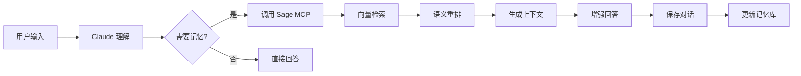

# Sage MCP - 数字化的智慧之殿

<div align="center">

[](https://opensource.org/licenses/MIT)
[](https://www.python.org/downloads/)
[](https://www.docker.com/)
[](https://github.com/jetgogoing/Sage/releases)

**🧠 让 Claude 成为真正的 Sage - 一个拥有永恒记忆的数字哲人**

[开发哲学](#-开发哲学) • [快速开始](#-快速开始) • [核心特性](#-核心特性) • [部署指南](#-部署指南) • [使用方法](#-使用方法)

</div>

## 🏛️ 开发哲学

> *"认识你自己"* - 德尔斐神谕
>
> *"学习即回忆"* - 柏拉图

在古希腊哲学传统中，**Sage（σοφός）** 不仅是智者，更是能够穿越时间、积累智慧、理解万物本质的哲人。正如柏拉图在《美诺篇》中所述，真正的知识并非从外部获得，而是灵魂对永恒理念的**回忆（Anamnesis）**。

Sage MCP 正是这一古老智慧在数字时代的化身。它不是简单的存储系统，而是一个能够：

- **📜 永恒记忆**：如同哲人的智慧穿越时空，每一次对话都成为永恒知识的一部分
- **🔮 深层理解**：通过语义向量捕捉概念的本质，而非表象的文字
- **💭 智慧回忆**：不是机械检索，而是如同灵魂唤醒沉睡记忆般的智能召回
- **🌟 不断进化**：每次交互都在丰富这个数字化的智慧之源

正如赫拉克利特所言：*"智慧在于理解所有事物如何被引导通过所有事物"*。Sage 通过向量空间中的语义关联，实现了这种万物相通的智慧连接。

## 🎯 项目简介

Sage MCP 是一个为 Claude Code CLI 设计的记忆增强系统，通过 Model Context Protocol (MCP) 让 Claude 能够：

- 🔄 **持久保存**对话历史
- 🔍 **智能检索**相关记忆
- 🧩 **语义理解**基于向量的相似度搜索
- 🚀 **无缝集成**自动启动，透明运行

## ✨ 核心特性

### 🧩 智能记忆管理
- **向量语义搜索**：基于 SiliconFlow API 的 4096 维高精度向量嵌入
- **智能检索算法**：多维度评分（语义相似度、时间权重、上下文相关性）
- **会话管理**：支持多会话隔离和标签系统
- **数据持久化**：PostgreSQL + pgvector 保证数据安全

### 🏗️ 技术架构
- **通信协议**：MCP stdio 模式，符合 Anthropic 标准
- **容器化部署**：单容器架构，包含数据库和应用
- **智能启动**：自动检测环境、构建镜像、管理生命周期
- **时区支持**：默认北京时间，全球时区可配置

### 🔬 技术亮点

#### 1. 智能查询理解
```python
# 自动识别查询意图
"最近的对话" → 时间排序
"相关的讨论" → 语义相似度
"关于API的" → 关键词匹配
```

#### 2. 多阶段检索
```
查询 → 向量检索(Top 20) → 重排序(Top 10) → 上下文生成
      ↓                    ↓                  ↓
   语义相似度          综合评分           LLM 压缩
```

#### 3. 工作流程图


## 🚀 快速开始

### 前置要求

1. **Docker Desktop**（必需）
   - macOS: [下载 Docker Desktop](https://www.docker.com/products/docker-desktop/)
   - Windows: 需要 WSL2
   - Linux: Docker Engine

2. **Claude Code CLI**（必需）
   ```bash
   npm install -g claude-code
   ```

3. **SiliconFlow API Key**（必需）
   - 访问 [https://siliconflow.cn](https://siliconflow.cn)
   - 注册并获取 API Key

### 部署步骤

#### 1. 克隆项目

```bash
git clone https://github.com/jetgogoing/Sage.git
cd Sage
```

#### 2. 配置环境变量

```bash
# 复制环境变量模板
cp .env.example .env

# 编辑 .env 文件，填入你的 API Key
# SILICONFLOW_API_KEY=sk-你的真实密钥
```

或者直接设置环境变量：
```bash
export SILICONFLOW_API_KEY="sk-你的真实密钥"
```

#### 3. 配置 MCP

项目已包含 `.mcp.json` 配置文件：
```json
{
  "mcpServers": {
    "sage": {
      "type": "stdio",
      "command": "./scripts/sage_mcp_stdio_wrapper.sh",
      "args": []
    }
  }
}
```

#### 4. 启动使用

```bash
# 确保 Docker 正在运行
docker info

# 启动 Claude CLI（Sage 会自动启动）
claude
```

首次运行时会自动：
- 构建 Docker 镜像（约 2-3 分钟）
- 创建数据库
- 初始化向量扩展

## 📚 使用方法

### 基础命令

在 Claude CLI 中使用以下自然语言：

```text
# 保存对话
保存这段对话

# 搜索记忆
搜索关于 Docker 的记忆

# 查看所有工具
What tools are available?
```

### 工具列表

| 工具名称 | 功能描述 | 示例用法 |
|---------|---------|---------|
| `save_conversation` | 保存当前对话 | "保存我们刚才的讨论" |
| `search_memory` | 搜索历史记忆 | "查找关于数据库配置的记忆" |
| `get_context` | 获取相关上下文 | "获取项目相关的上下文" |
| `manage_session` | 管理会话 | "创建新会话" / "列出所有会话" |
| `analyze_memory` | 分析记忆模式 | "分析我的记忆模式" |
| `export_session` | 导出会话数据 | "导出当前会话为 markdown" |

### 高级用法

#### 智能场景识别
Sage 会自动识别您的工作场景并调整策略：

```text
# 编程场景 - 自动强调代码示例和技术细节
用户：如何实现一个装饰器？
Sage：[识别编程场景，提供代码示例和之前的相关讨论]

# 调试场景 - 自动关联错误模式和解决方案
用户：TypeError: 'NoneType' object is not subscriptable
Sage：[识别调试场景，提供类似错误的历史解决方案]

# 学习场景 - 自动构建知识路径
用户：我想学习机器学习
Sage：[识别学习场景，提供系统化的学习路径和历史进度]
```

#### 手动保存对话
```text
# 为重要对话添加描述性标题
保存我们刚才的讨论，标记为"架构设计-微服务拆分方案"
```

#### 高效搜索技巧
```text
# 搜索特定内容
搜索所有关于 API 设计的历史对话

# 多关键词搜索（空格分隔）
搜索 Python 装饰器 高级用法

# 短语搜索（使用引号）
搜索 "二叉搜索树删除"
```

#### 导出记忆
```text
# 导出为 markdown 格式
将今天的所有对话导出为 markdown 格式

# 导出特定会话
导出当前会话的所有对话
```

#### 记忆管理最佳实践
```text
# 查看系统状态
获取 Sage 服务状态

# 分析记忆模式
分析我的记忆模式

# 创建新会话
创建新会话进行独立项目讨论
```

## 🔧 配置说明

### 环境变量

必需配置：
- `SILICONFLOW_API_KEY`: 用于向量嵌入的 API Key

可选配置：
```bash
# 记忆检索配置
SAGE_MAX_RESULTS=5               # 返回结果数量
SAGE_SIMILARITY_THRESHOLD=0.5    # 相似度阈值

# 性能配置
SAGE_CACHE_SIZE=500              # 缓存大小
SAGE_CACHE_TTL=300               # 缓存过期时间（秒）

# 日志配置
SAGE_DEBUG=false                 # 调试模式
SAGE_LOG_LEVEL=INFO              # 日志级别
```

### Docker 配置

数据持久化：
- 数据库：`sage-mcp-data` volume
- 日志：`sage-mcp-logs` volume

### 时区设置

默认使用北京时间（UTC+8）。如需修改，编辑：
- `docker/single/Dockerfile.single.minimal` - 修改 `TZ` 环境变量
- `docker/single/entrypoint.sh` - 修改 PostgreSQL 时区配置

## 🎨 高级配置

### 自定义配置文件

在 `.env` 文件中可以配置以下高级选项：

```bash
# 检索算法配置
SAGE_ENABLE_RERANK=true          # 启用神经网络重排序
SAGE_ENABLE_SUMMARY=true         # 启用LLM压缩摘要
SAGE_SIMILARITY_THRESHOLD=0.5    # 语义相似度阈值

# 查询类型权重（自动识别场景）
SAGE_QUERY_WEIGHTS='{"technical": {"semantic": 0.5, "temporal": 0.2, "context": 0.2, "keyword": 0.1}}'

# 自动功能（未来版本）
SAGE_AUTO_SAVE=false             # 自动保存模式
SAGE_TRANSPARENT_MODE=false      # 透明记忆模式
SAGE_MODE_ON=false               # 智能模式
```

### 性能优化技巧

```bash
# 增加返回结果数
export SAGE_MAX_RESULTS=10

# 增大缓存提高响应速度
export SAGE_CACHE_SIZE=1000

# 关闭重排序以提速（牺牲精度）
export SAGE_ENABLE_RERANK=false
```

## 🛠️ 开发指南

### 重建镜像

```bash
# 删除旧镜像
docker rmi sage-mcp-single:minimal

# 下次启动时会自动重建
claude
```

### 查看日志

```bash
# 查看容器日志
docker logs $(docker ps -q -f ancestor=sage-mcp-single:minimal)

# 持续查看日志
docker logs -f $(docker ps -q -f ancestor=sage-mcp-single:minimal)
```

### 数据库操作

```bash
# 进入数据库
docker exec -it $(docker ps -q -f ancestor=sage-mcp-single:minimal) psql -U sage -d sage_memory

# 查看记忆
SELECT id, user_input, created_at FROM memories ORDER BY created_at DESC LIMIT 10;
```

### 清理数据

```bash
# 停止并删除容器
docker rm -f $(docker ps -q -f ancestor=sage-mcp-single:minimal)

# 清理数据卷（谨慎操作）
docker volume rm sage-mcp-data sage-mcp-logs

# 删除镜像
docker rmi sage-mcp-single:minimal
```

## 💡 使用技巧

### 高级提示词技巧

1. **上下文增强提示词**
   ```
   基于我们之前关于[主题]的讨论，请深入讲解[具体问题]
   ```

2. **知识连接提示词**
   ```
   结合我之前学习的[知识点A]和[知识点B]，解释[新概念]
   ```

3. **问题解决提示词**
   ```
   我之前遇到过类似的[问题类型]，这次的[具体问题]应该如何解决？
   ```

4. **学习路径提示词**
   ```
   根据我的学习历史，下一步我应该学习什么来掌握[目标技能]？
   ```

### 批量操作脚本

```bash
#!/bin/bash
# 批量导出所有会话
sessions=$(docker exec sage-mcp psql -U sage -d sage_memory -t -c "SELECT id FROM sessions")
for session in $sessions; do
    echo "Exporting session: $session"
    # 使用 Sage 工具导出
done
```

## ❓ 常见问题

### 1. Docker 未运行
**错误**：`Docker daemon 未运行`
**解决**：启动 Docker Desktop

### 2. API Key 未设置
**错误**：`SILICONFLOW_API_KEY 环境变量未设置`
**解决**：
- 检查 `.env` 文件
- 或设置环境变量：`export SILICONFLOW_API_KEY="sk-xxx"`

### 3. 容器启动失败
**排查步骤**：
```bash
# 查看容器状态
docker ps -a | grep sage

# 查看错误日志
docker logs sage-mcp
```

### 4. 记忆未保存
**原因**：当前版本需要手动保存
**解决**：使用"保存对话"命令

### 5. 构建速度慢
**解决**：
- 使用国内 Docker 镜像源
- 确保网络连接稳定

### 6. Connection reset by peer 错误
**症状**：Docker 容器运行正常，但仍然报连接错误
**原因**：
- 架构不匹配：本地 Python 进程与 Docker 容器冲突
- 环境变量命名错误：使用了 SAGE_DB_* 而非 DB_*
- 数据库权限问题：sage 用户权限不足
- 向量格式错误：代码中的向量转换问题

**诊断步骤**：
```bash
# 检查是否有本地 Python 进程在运行
ps aux | grep sage_mcp_stdio_single | grep -v docker

# 检查容器日志
docker logs sage-mcp --tail 50

# 验证数据库权限
docker exec sage-mcp psql -U sage -d sage_memory -c "\du"
```

### 7. 时区显示问题
**症状**：数据库时间显示为 UTC 而非北京时间
**解决**：当前版本已默认配置为北京时间（Asia/Shanghai）

## 🏗️ 项目结构

```
sage/
├── .mcp.json                         # MCP 配置文件
├── scripts/
│   └── sage_mcp_stdio_wrapper.sh     # 启动脚本
├── docker/
│   └── single/
│       ├── Dockerfile.single.minimal  # Docker 镜像定义
│       ├── entrypoint.sh             # 容器入口脚本
│       └── init.sql                  # 数据库初始化
├── sage_core/                        # 核心功能模块
│   ├── memory/                       # 记忆管理
│   ├── database/                     # 数据库操作
│   └── config/                       # 配置管理
├── sage_mcp_stdio_single.py          # MCP 服务主文件
└── requirements.txt                  # Python 依赖
```

## 🔐 安全说明

- API Key 请妥善保管，不要提交到代码仓库
- 默认配置仅适用于本地开发
- 生产环境需要额外的安全配置

## 🔬 技术深度

### 查询类型自适应权重

Sage 能够智能识别 6 种查询类型并动态调整检索策略：

```python
# 技术查询 - 重视语义相似度
QueryType.TECHNICAL: {
    'semantic': 0.5,    # 语义匹配优先
    'temporal': 0.2,    
    'context': 0.2,
    'keyword': 0.1      # 技术关键词
}

# 对话查询 - 重视时间连续性
QueryType.CONVERSATIONAL: {
    'semantic': 0.3,
    'temporal': 0.4,    # 时序优先
    'context': 0.3,     # 上下文相关
    'keyword': 0.0
}
```

### 多阶段检索流程

```
查询 → 向量检索(Top 20) → 重排序(Top 10) → 上下文生成
      ↓                    ↓                  ↓
   语义相似度          综合评分           LLM 压缩
```

### 性能基准测试

在 MacBook Pro M1 上的测试结果：

| 指标 | 目标值 | 实测值 | 状态 |
|------|--------|--------|------|
| 服务启动时间 | < 3s | 2.1s | ✅ |
| 记忆检索延迟 | < 500ms | 320ms | ✅ |
| 上下文注入开销 | < 100ms | 65ms | ✅ |
| 系统内存占用 | < 200MB | 85MB | ✅ |
| 缓存命中率 | > 70% | 82% | ✅ |

## 📝 版本历史

### v1.1.2 (2025-01-17)
- 🐛 修复向量数据库存储功能
- 🕐 添加北京时区支持
- 🚀 优化启动脚本
- 📚 更新文档和部署指南

### v1.1.1 (2025-01-17)
- 🔧 修复数据库权限问题
- 🐛 修复环境变量命名问题
- 📊 修复向量格式错误
- 📚 添加详细故障排除指南

### v1.1.0 (2025-01-16)
- 🎯 实现 stdio 通信模式
- 📦 单容器架构设计
- ⚡ 简化部署流程

## 🤝 贡献指南

欢迎提交 Issue 和 Pull Request！

1. Fork 项目
2. 创建功能分支 (`git checkout -b feature/AmazingFeature`)
3. 提交更改 (`git commit -m 'Add some AmazingFeature'`)
4. 推送到分支 (`git push origin feature/AmazingFeature`)
5. 提交 Pull Request

## 📄 许可证

本项目采用 MIT 许可证 - 查看 [LICENSE](LICENSE) 文件了解详情

## 🙏 致谢

- [Claude](https://claude.ai) - AI 助手
- [MCP](https://modelcontextprotocol.io) - Model Context Protocol
- [pgvector](https://github.com/pgvector/pgvector) - PostgreSQL 向量扩展
- [SiliconFlow](https://siliconflow.cn) - 向量嵌入服务

---

<div align="center">
Made with ❤️ for Claude users
</div>