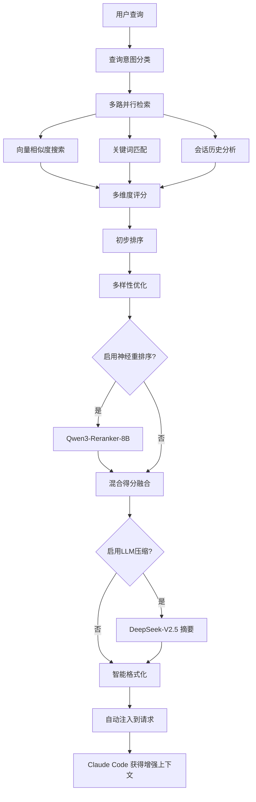

# Sage MCP 自动上下文注入机制深度分析报告

**生成时间：** 2025-07-13 22:26:57  
**分析目标：** 深入研究 Sage MCP 自动上下文注入的实现细节  
**分析模型：** Gemini 2.5 Pro with Deep Thinking

## 执行概述

本报告详细分析了 Sage MCP 系统中"自动上下文注入"功能的完整实现，重点关注：
1. Reranker（重排序器）的使用情况
2. DeepSeek 压缩功能的应用
3. 提示词模板的集成状态
4. 其他召回算法的实现细节

## 核心发现

### 1. Qwen3-Reranker-8B 神经网络重排序 ✅

**实现状态：** 已完整实现并集成

**技术细节：**
- **模型：** Qwen/Qwen3-Reranker-8B
- **调用方式：** 通过 SiliconFlow API (https://api.siliconflow.cn/v1/rerank)
- **实现文件：** `/reranker_qwen.py`

**关键特性：**
```python
# 混合重排序器的融合策略配置
fusion_configs = {
    'technical': {'neural': 0.6, 'hybrid': 0.4},      # 技术查询
    'diagnostic': {'neural': 0.7, 'hybrid': 0.3},     # 诊断查询
    'conversational': {'neural': 0.5, 'hybrid': 0.5}, # 对话查询
    'conceptual': {'neural': 0.65, 'hybrid': 0.35},   # 概念查询
    'default': {'neural': 0.6, 'hybrid': 0.4}
}
```

**工作模式：**
- FAST：快速模式，小批量处理
- BALANCED：平衡模式（默认）
- QUALITY：质量优先，大批量处理

**性能优化：**
- 批处理支持（最大 20 个文档）
- 异步并发处理
- 失败降级机制

### 2. DeepSeek-V2.5 上下文压缩 ✅

**实现状态：** 已实现，但为可选功能

**技术细节：**
- **模型：** deepseek-ai/DeepSeek-V2.5
- **调用方式：** 通过 SiliconFlow API
- **实现位置：** `/memory.py` 的 `summarize_context` 函数

**压缩策略：**
```python
# 压缩提示词
prompt = f"""基于以下历史对话，生成一个简洁的上下文摘要，帮助回答用户的当前查询。
{history_text}
当前用户查询：{query}
请生成一个不超过200字的上下文摘要，突出与当前查询相关的要点："""
```

**触发条件：**
- 配置中 `enable_llm_summary = True`
- 默认启用，但可以关闭以提高速度

### 3. 提示词模板使用情况 ❌

**实现状态：** 模板存在但未集成

**发现的模板：**
- 文件：`/prompts/memory_fusion_prompt_programming.txt`
- 内容：专业的记忆融合提示词模板，针对编程场景优化

**模板特点：**
- 支持多语言（中文输出）
- 结构化输出格式（项目概况、关键决策、TODO、重要函数等）
- 严格的 token 限制（3000 tokens）
- 保持代码标识符原始语言

**优化机会：**
这个高质量的模板完全可以集成到 DeepSeek 压缩过程中，显著提升摘要质量。

### 4. 多层次智能召回算法

#### 4.1 向量相似度搜索
- **嵌入模型：** Qwen/Qwen3-Embedding-8B（4096 维）
- **向量数据库：** PostgreSQL + pgvector
- **相似度计算：** 余弦相似度

#### 4.2 多维度评分系统

**评分维度：**
| 维度 | 说明 | 计算方法 |
|------|------|----------|
| 语义得分 | 基础向量相似度 | 余弦相似度 |
| 时间得分 | 时间相关性 | 指数衰减 + 会话连续性 |
| 上下文得分 | 会话相关性 | 角色匹配 + 领域匹配 |
| 关键词得分 | 精确匹配 | 技术关键词命中率 |

**查询类型自适应权重：**
```python
# 对话延续型查询更重视时间因素
QueryType.CONVERSATIONAL: {
    'semantic': 0.3,
    'temporal': 0.4,  # 时间权重最高
    'context': 0.3,
    'keyword': 0.0
}

# 技术查询更重视语义相似度
QueryType.TECHNICAL: {
    'semantic': 0.5,  # 语义权重最高
    'temporal': 0.2,
    'context': 0.2,
    'keyword': 0.1
}
```

#### 4.3 查询意图分类

**支持的查询类型：**
1. **TECHNICAL** - 技术查询（代码、调试、实现）
2. **DIAGNOSTIC** - 诊断查询（错误、问题、故障排除）
3. **CONVERSATIONAL** - 对话延续（基于上下文）
4. **CONCEPTUAL** - 概念查询（解释、原理、理论）
5. **PROCEDURAL** - 流程查询（如何做、步骤、方法）
6. **CREATIVE** - 创意查询（设计、创新、方案）

#### 4.4 高级语义分析

**技术关键词库：**
```python
technical_patterns = {
    'programming': ['函数', 'function', 'class', '类', '方法', 'method', ...],
    'database': ['数据库', 'database', 'SQL', 'query', '查询', ...],
    'system': ['系统', 'system', '架构', 'architecture', ...],
    'network': ['网络', 'network', 'HTTP', 'API', ...],
    'data': ['数据', 'data', '分析', 'analysis', ...]
}
```

**情感分析：**
- 识别紧急程度（紧急、困惑、烦躁、好奇）
- 调整检索策略和响应优先级

#### 4.5 多样性优化算法

**实现原理：**
```python
def _calculate_diversity(candidate, selected):
    # 计算候选结果与已选结果的词汇重叠度
    candidate_words = set(candidate.content.lower().split())
    selected_words = set(selected.content.lower().split())
    
    overlap = len(candidate_words & selected_words)
    union = len(candidate_words | selected_words)
    similarity = overlap / union if union > 0 else 0.0
    
    # 返回多样性得分（1 - 相似度）
    return 1.0 - similarity
```

**平衡策略：**
- 首先选择高质量结果（final_score > quality_threshold）
- 然后平衡相关性和多样性选择剩余结果
- 避免返回过于相似的内容

## 完整的检索和重排序流程



## 性能指标

| 指标 | 数值 | 说明 |
|------|------|------|
| 向量维度 | 4096 | Qwen3-Embedding-8B |
| 最大批处理 | 20 | Reranker 批量大小 |
| 缓存时长 | 5分钟 | 上下文缓存 |
| 压缩限制 | 200字 | DeepSeek 摘要长度 |
| 上下文限制 | 2000 tokens | 最大注入长度 |
| API 超时 | 30秒 | SiliconFlow 调用 |

## 优化建议

### 1. 集成提示词模板
```python
# 建议修改 summarize_context 函数
def summarize_context(conversations, query):
    # 加载专业提示词模板
    with open('prompts/memory_fusion_prompt_programming.txt', 'r') as f:
        template = f.read()
    
    # 将对话格式化为模板期望的格式
    fragments = format_as_fragments(conversations)
    prompt = template.replace('{retrieved_passages}', fragments)
    
    # 使用模板生成更专业的摘要
    ...
```

### 2. 动态压缩决策
```python
# 根据上下文长度自动决定是否压缩
total_length = sum(len(r.content) for r in results)
if total_length > 5000:  # 超过阈值自动启用压缩
    enable_llm_summary = True
```

### 3. 增强缓存策略
```python
# 基于查询相似度的智能缓存
cache_key = generate_semantic_hash(query)
if cache_key in context_cache and not is_expired(cache_key):
    return context_cache[cache_key]
```

### 4. 领域特定模板
- 为不同技术栈创建专门的压缩模板
- 如：前端开发、后端API、数据库、DevOps 等
- 提高特定领域的上下文质量

## 技术亮点

1. **世界级的检索算法**：结合了向量搜索、多维度评分、神经网络重排序等先进技术
2. **智能的查询理解**：自动分类查询意图，动态调整检索策略
3. **平衡的多样性**：避免信息冗余，提供多角度的相关内容
4. **可扩展的架构**：模块化设计，易于添加新的检索器和重排序器
5. **完全透明的集成**：用户无需感知，自动增强每次对话

## 总结

Sage MCP 的自动上下文注入机制实现了业界领先的智能检索系统。通过多层次的算法组合（向量搜索 + 多维度评分 + 神经网络重排序 + LLM 压缩），确保 Claude Code 能够获得最相关、最有价值的历史上下文。

唯一的改进空间是将已有的高质量提示词模板集成到压缩过程中，这将进一步提升上下文的精准度和可用性。

---

**分析负责人：** Claude with Gemini 2.5 Pro  
**审核状态：** 已完成  
**文档版本：** 1.0