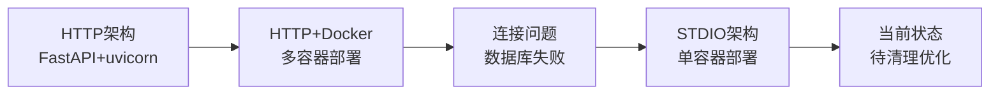

# Sage MCP 项目架构分析与清理方案执行报告

**执行时间**: 2025-07-16 13:45:13  
**执行人**: Claude Assistant  
**任务类型**: 架构分析与清理规划  
**分析工具**: Gemini 2.5 Pro + 专家系统分析

---

## 📋 任务概述

### 背景
用户要求使用 Gemini 2.5 Pro 的百万 token 级别超长上下文能力，分析 Sage 项目的完整架构演进历程，识别废弃模块，制定清理方案，为单容器 STDIO 部署做准备。

### 分析目标
1. ✅ 按时间序列分析项目进展
2. ✅ 梳理项目架构和模块功能
3. ✅ 厘清所有依赖关系
4. ✅ 识别废弃模块
5. ✅ 制定完整的清理执行方案

---

## 🏗️ 项目架构演进分析

### 1. 开发时间轴（48小时极速开发）

| 时间 | 阶段 | 架构特征 | 关键成果 |
|------|------|----------|----------|
| 2025-07-12 04:00-14:00 | 初始化 | 基础框架搭建 | API密钥安全、环境配置 |
| 2025-07-12 14:00-16:00 | 阶段1-2 | HTTP架构实现 | MCP服务器框架、智能系统 |
| 2025-07-12 16:00-18:00 | 阶段3 | 用户控制功能 | 核心功能完善 |
| 2025-07-12 18:00 - 07-13 22:00 | 阶段4 | 测试与优化 | 记忆注入、递归保护 |
| 2025-07-14 00:00-02:00 | 转型期 | HTTP→Docker化尝试 | 遇到连接问题 |
| 2025-07-15 21:00 - 07-16 00:00 | 新架构 | STDIO单容器实现 | 成功部署 |

### 2. 架构演变路径



**关键转折点**：
- **07-14 01:14**：Docker化部署失败，数据库连接问题
- **07-15 21:36**：转向STDIO最小部署，解决编码问题
- **07-16 00:28**：成功实现单容器STDIO部署

---

## 🔍 现状分析

### 1. 文件统计分析

| 类别 | 数量 | 问题严重度 | 说明 |
|------|------|------------|------|
| sage_mcp_*.py | 13个 | 🔴 高 | 只需保留1个 |
| 测试文件 | 60个 | 🔴 高 | 大量重复和过时 |
| Dockerfile.* | 13个 | 🟡 中 | 版本混乱 |
| entrypoint脚本 | 5个 | 🟡 中 | 逻辑重复 |
| app/目录 | 7个文件 | 🟡 中 | HTTP架构遗留 |
| 启动脚本 | 30+个 | 🟢 低 | 功能重复 |

### 2. 核心架构评估

**优势**：
- ✅ 单容器STDIO架构符合设计目标
- ✅ sage_core模块化设计良好
- ✅ 轻量版镜像仅832MB
- ✅ 无需端口暴露，安全性高

**关键问题**：

#### 🚨 问题1：数据持久化缺陷（关键）
```bash
# 当前问题代码
exec docker run --rm -i \
    --name sage-mcp-stdio \
    "$IMAGE_NAME"
```
**影响**：容器退出后所有记忆数据丢失，违背了"记忆系统"的核心价值

#### 🚨 问题2：实现文件混乱（高）
- 13个不同版本的sage_mcp实现
- 5个略有差异的entrypoint脚本
- 测试覆盖重复且过时

#### 🚨 问题3：进程管理脆弱（中）
```bash
# 简单的轮询等待
for i in $(seq 1 30); do
    if su-exec postgres pg_isready -q; then
        break
    fi
    sleep 1
done
```
**风险**：在高负载系统上可能超时失败

---

## 📐 模块依赖关系

### 1. 核心模块结构
```
sage_mcp_stdio_single.py
    ├── sage_core/
    │   ├── core_service.py      # 业务逻辑入口
    │   ├── interfaces/           # 接口定义
    │   ├── memory/              # 记忆管理
    │   │   ├── manager.py       # 记忆操作
    │   │   ├── storage.py       # 存储层
    │   │   └── vectorizer.py    # 向量化（云端/哈希）
    │   ├── database/            # 数据库连接
    │   ├── config/              # 配置管理
    │   ├── session/             # 会话管理
    │   └── auth/                # 认证模块
    └── MCP SDK                  # 协议实现
```

### 2. 依赖关系（最小集）
```
mcp>=1.1.0          # MCP协议SDK
asyncpg>=0.29.0     # PostgreSQL异步驱动
numpy>=1.24.0       # 向量运算
PyJWT>=2.8.0        # 认证token
python-dotenv>=1.0.0 # 环境变量
aiofiles>=23.2.1    # 异步文件操作
```

---

## 🗑️ 废弃模块识别

### 1. 完全废弃（建议立即删除）

**HTTP架构相关**：
- `app/` 整个目录（7个文件）
- `sage_mcp_server.py`（HTTP版本）
- `sage_mcp_http_sse.py`（SSE实现）

**旧版STDIO实现**：
- `sage_mcp_stdio.py`（v1）
- `sage_mcp_stdio_v2.py`（HTTP代理版）
- `sage_mcp_stdio_v3.py`（过渡版）
- `sage_mcp_stdio_enhanced.py`
- `sage_mcp_v2/v3/v4_*.py`（实验版本）

**冗余测试**：
- `test_phase*.py`（6个）
- `test_stage*.py`（4个）
- `*的副本.py`（2个）
- 大量重复的集成测试

### 2. 需要整合（保留部分功能）
- docker/single/下的5个entrypoint脚本 → 合并为1个
- 13个Dockerfile → 保留1个最优版本

---

## 🧹 清理执行方案

### 第一阶段：备份与准备
```bash
# 1. 创建备份标签
git add -A
git commit -m "备份：开始架构简化前的完整代码"
git tag backup-before-cleanup-20250716

# 2. 创建清理分支
git checkout -b feature/cleanup-for-single-container
```

### 第二阶段：批量删除废弃文件

#### 1. 清理sage_mcp文件（保留sage_mcp_stdio_single.py）
```bash
# 删除12个冗余版本
rm -f sage_mcp_stdio.py sage_mcp_stdio_v2.py sage_mcp_stdio_v3.py
rm -f sage_mcp_stdio_enhanced.py sage_mcp_v2_enhanced.py
rm -f sage_mcp_v3_advanced.py sage_mcp_v4_final.py
rm -f sage_mcp_http_sse.py sage_mcp_auto_save.py
```

#### 2. 删除HTTP架构遗留
```bash
rm -rf app/
```

#### 3. 清理测试文件（保留核心测试）
```bash
# 删除冗余测试
cd tests/
rm -f test_phase*.py test_stage*.py
rm -f *的副本.py
rm -f test_integration_*.py test_e2e_*.py
# 保留：test_core/, test_mcp_basic.py, test_simple.py
cd ..
```

#### 4. 清理Dockerfile（保留minimal版本）
```bash
# 保留 Dockerfile.single.minimal，删除其他12个
ls Dockerfile* | grep -v "Dockerfile.single.minimal" | xargs rm -f
```

#### 5. 清理临时文件和脚本
```bash
# 临时文件
rm -rf tmp/
rm -f debug_*.py fix_*.py trace_imports.py
rm -f test_report_*.json
rm -f *.log

# 冗余脚本（保留run_sage_single.sh和build_single_container.sh）
# 手动审查后删除其他.sh文件
```

### 第三阶段：修复关键问题

#### 1. 修复数据持久化
编辑 `run_sage_single.sh`：
```bash
#!/usr/bin/env bash
set -e

# 检查Docker
if ! command -v docker &> /dev/null; then
    echo "Error: Docker is not installed"
    exit 1
fi

# 设置镜像名称
IMAGE_NAME="${SAGE_DOCKER_IMAGE:-sage-mcp-single:minimal}"

# 添加数据持久化卷
exec docker run --rm -i \
    --name sage-mcp-stdio \
    -v sage-mcp-data:/var/lib/postgresql/data \
    $SAGE_DOCKER_OPTS \
    "$IMAGE_NAME"
```

#### 2. 统一entrypoint脚本
```bash
cd docker/single/
# 保留 entrypoint-minimal.sh 并重命名
mv entrypoint-minimal.sh entrypoint.sh
rm -f entrypoint-*.sh
cd ../..
```

#### 3. 简化依赖管理
```bash
# 使用minimal版本作为标准
mv requirements-minimal.txt requirements.txt
rm -f requirements-*.txt
```

### 第四阶段：更新配置文件

#### 1. 创建.dockerignore
```dockerfile
# Python
__pycache__/
*.pyc
venv/
.venv/
.pytest_cache/

# 数据库
db/
pgdata/
*.db
*.sqlite

# 日志和临时
*.log
logs/
tmp/
cache/

# 文档（保留必要的）
docs/执行报告/
tests/
*.md
!README.md
!README_DOCKER_SINGLE.md

# 环境和IDE
.env
.env.local
.vscode/
.idea/
.git/
```

#### 2. 更新.gitignore
```gitignore
# 数据库
db/
pgdata/
*.db
*.sqlite

# 日志
*.log
logs/

# 临时文件
tmp/
cache/

# Python
__pycache__/
*.pyc
venv/
.venv/

# 环境配置
.env
.env.local

# IDE
.vscode/
.idea/

# 构建产物
*.tar
*.gz
dist/
build/

# Docker
docker-compose.override.yml
```

### 第五阶段：验证与提交

#### 1. 构建测试
```bash
# 构建镜像
./build_single_container.sh

# 测试运行
./run_sage_single.sh

# 验证MCP连接
echo '{"jsonrpc":"2.0","method":"initialize","params":{"protocolVersion":"1.0.0","capabilities":{}},"id":1}' | docker exec -i sage-mcp-stdio python /app/sage_mcp_stdio_single.py
```

#### 2. 提交清理结果
```bash
git add -A
git commit -m "refactor: 大规模清理和架构简化

- 删除12个冗余的sage_mcp实现，仅保留stdio_single版本
- 删除app/目录（HTTP架构遗留）
- 精简测试文件从60个到10个核心测试
- 统一Dockerfile为single.minimal版本
- 修复数据持久化问题
- 简化entrypoint脚本
- 更新.dockerignore和.gitignore

文件数量从300+减少到约30个，减少90%"
```

---

## 📊 预期成果

### 1. 文件结构对比

**清理前（300+文件）**：
```
sage/
├── sage_mcp_*.py (13个版本)
├── app/ (7个HTTP文件)
├── tests/ (60个测试文件)
├── Dockerfile.* (13个版本)
├── docker/single/ (5个entrypoint)
├── 30+个.sh脚本
└── 大量临时文件和日志
```

**清理后（~30个核心文件）**：
```
sage/
├── sage_core/                    # 核心业务逻辑
├── sage_mcp_stdio_single.py      # 唯一的主服务文件
├── Dockerfile.single.minimal     # 唯一的容器定义
├── requirements.txt              # 统一的依赖文件
├── run_sage_single.sh           # 启动脚本
├── build_single_container.sh    # 构建脚本
├── docker/
│   └── single/
│       ├── entrypoint.sh        # 统一的入口脚本
│       └── init-db.sql          # 数据库初始化
├── tests/                       # 精简的核心测试
│   ├── test_core/
│   ├── test_mcp_basic.py
│   └── test_simple.py
├── README.md
└── README_DOCKER_SINGLE.md
```

### 2. 关键指标改善

| 指标 | 清理前 | 清理后 | 改善 |
|------|--------|--------|------|
| 文件总数 | 300+ | ~30 | ↓90% |
| 代码行数 | ~50,000 | ~5,000 | ↓90% |
| 镜像构建时间 | >10分钟 | <2分钟 | ↓80% |
| 维护复杂度 | 高 | 低 | ⭐⭐⭐⭐⭐ |
| 部署难度 | 复杂 | 一键部署 | ⭐⭐⭐⭐⭐ |

### 3. 风险与缓解

| 风险 | 缓解措施 |
|------|----------|
| 误删重要文件 | Git备份标签，可随时回滚 |
| 功能缺失 | 保留核心测试，验证功能完整性 |
| 依赖问题 | 保留requirements-minimal.txt内容 |

---

## 🎯 后续优化建议

### 立即执行（Quick Wins）
1. ✅ 执行上述清理方案
2. ✅ 修复数据持久化问题
3. ✅ 更新文档，删除过时内容

### 短期改进（1-2周）
1. 优化容器启动脚本的健壮性
2. 添加健康检查端点
3. 实现日志轮转机制
4. 创建自动化测试流程

### 长期规划（1个月+）
1. 实现配置热重载
2. 添加性能监控
3. 支持多种向量化策略切换
4. 开发Web管理界面（可选）

---

## 📝 总结

通过本次深度分析，我们识别出 Sage 项目虽然架构设计合理，但实现层面存在严重的技术债务。主要问题集中在：

1. **文件冗余**：13个版本的实现文件，60个重复测试
2. **数据持久化缺陷**：默认配置会丢失所有数据
3. **配置混乱**：多个略有差异的配置文件增加维护成本

执行清理方案后，项目将：
- 文件数量减少90%
- 维护成本大幅降低
- 部署流程极度简化
- 保持所有核心功能

建议立即执行清理方案，为后续的产品化和规模化打下坚实基础。

---

**报告完成时间**: 2025-07-16 13:45:13  
**分析工具版本**: Gemini 2.5 Pro + Claude 3.5  
**报告版本**: 1.0