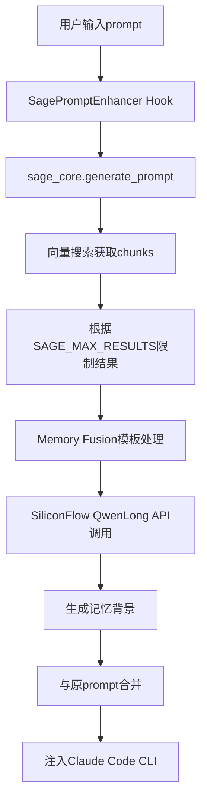

# SiliconFlow QwenLong-L1-32B 集成统一执行计划

## 项目背景与目标

基于深度调试分析发现，SagePromptEnhancer系统的AI压缩环节完全未实现（DeepSeek v2.5 API标记为TODO），导致系统始终返回40-41字符的固定模板。**关键发现**：项目中已有成熟的SiliconFlow API基础设施用于Qwen3-Embedding-8B向量化，因此采用扩展现有架构的策略，而非新建独立API客户端。

### 核心目标
- 替换`sage_core/core_service.py`中`_compress_context_with_ai`方法的TODO实现
- 利用SiliconFlow的`Tongyi-Zhiwen/QwenLong-L1-32B`模型实现真正的智能记忆压缩
- 解决当前返回固定模板的问题，实现个性化的上下文增强

### 技术策略
**复用现有架构**：扩展`sage_core/memory/vectorizer.py`的设计模式，而不是创建全新的API模块，确保架构一致性和开发效率。

---

## 完整RAG流程架构



---

## 详细执行计划

### Phase 1: 基础设施扩展与配置 (预计：2小时)

此阶段目标是建立调用文本生成模型的基础，确保配置的灵活性和安全性。

#### Step 1.1: 创建文本生成器模块 (1小时)
- **文件**: `sage_core/memory/text_generator.py`
- **目的**: 复用`sage_core/memory/vectorizer.py`的成功设计模式，适配文本生成API
- **具体操作**:
  1. 创建`TextGenerator`类，模仿`TextVectorizer`的结构
  2. `__init__`方法中加载SiliconFlow API密钥（复用`SILICONFLOW_API_KEY`环境变量）
  3. 设置base_url为`https://api.siliconflow.cn/v1`
  4. 默认模型设置为`Tongyi-Zhiwen/QwenLong-L1-32B`
  5. 创建核心方法`async def generate(self, messages, **kwargs)`
  6. 该方法向`/v1/chat/completions`端点发送POST请求
  7. 请求体包含`model`, `messages`（OpenAI格式）, `max_tokens`, `temperature`等参数
  8. 实现与vectorizer一致的错误处理和日志记录逻辑
  9. 添加降级机制：API失败时返回简化的本地处理结果

#### Step 1.2: 扩展统一配置管理 (0.5小时)
- **文件**: `sage_core/config/manager.py`
- **操作**:
  1. 在`_create_default_config()`方法中添加AI压缩相关配置
  2. 新增配置节点结构：
     ```json
     "ai_compression": {
       "provider": "siliconflow",
       "model": "Tongyi-Zhiwen/QwenLong-L1-32B",
       "max_tokens": 2000,
       "temperature": 0.3,
       "timeout_seconds": 30,
       "enable": true,
       "fallback_on_error": true
     }
     ```
  3. 添加`get_ai_compression_config()`方法返回AI压缩配置
  4. 确保复用现有的`SILICONFLOW_API_KEY`环境变量

#### Step 1.3: (推荐) 定义抽象接口 (0.5小时)
- **文件**: `sage_core/interfaces/ai_compressor.py`
- **目的**: 提高代码可维护性，为未来模型替换做准备
- **操作**:
  1. 创建`interfaces`目录（如不存在）
  2. 定义`AICompressor`抽象基类
  3. 包含`compress_context`抽象方法
  4. 让`TextGenerator`类实现此接口

---

### Phase 2: 核心压缩逻辑实现 (预计：1.5小时)

此阶段核心是替换`core_service.py`中的占位符逻辑。

#### Step 2.1: 修改 `_compress_context_with_ai()` 方法 (1小时)
- **文件**: `sage_core/core_service.py` (第224-262行)
- **当前状态**: TODO标记，使用关键词匹配占位符
- **具体操作**:
  1. 删除现有的TODO和占位符逻辑
  2. 从`self.config_manager`检查`ai_compression.enable`配置
  3. 如果未启用，直接调用现有的降级逻辑
  4. 初始化`TextGenerator`实例，传入配置参数
  5. 读取`os.getenv('SAGE_HOME', '.')/prompts/memory_fusion_prompt_programming.txt`模板内容
  6. 将检索到的上下文chunks和用户query格式化填入模板
  7. 构建符合chat/completions API格式的messages数组：
     - system message: 包含压缩指令和Memory Fusion模板
     - user message: 包含用户原始查询
  8. 调用`text_generator.generate()`方法
  9. 添加全面的异常处理：超时、认证失败、API限流等
  10. 记录详细的API调用耗时和结果统计
  11. 异常情况下，记录错误并调用降级处理

#### Step 2.2: 增强Memory Fusion模板处理 (0.5小时)
- **文件**: `sage_core/core_service.py` (`_apply_memory_fusion`方法)
- **操作**:
  1. 增加对`SAGE_MAX_RESULTS`配置的支持
  2. 改进chunks的组织和格式化逻辑
  3. 验证模板文件的完整性和占位符的正确性
  4. 优化中文语境下的模板处理

---

### Phase 3: RAG流程整合与完善 (预计：1小时)

确保AI压缩功能正确嵌入到完整的RAG流程中。

#### Step 3.1: 实现SAGE_MAX_RESULTS配置 (0.5小时)
- **文件**: `sage_core/core_service.py` (`generate_prompt`方法)
- **当前问题**: 硬编码max_results=10
- **操作**:
  1. 修改调用向量搜索的代码行
  2. 从`self.config_manager`读取`memory_fusion.max_results`值
  3. 提供默认值10，支持环境变量`SAGE_MAX_RESULTS`
  4. 将此值传递给`self.memory_manager.get_context`方法
  5. 添加配置值的有效性验证（范围1-100）

#### Step 3.2: 设计上下文注入格式 (0.5小时)
- **文件**: `hooks/scripts/sage_prompt_enhancer.py`
- **操作**:
  1. 确保从`_compress_context_with_ai`返回的结果被正确格式化
  2. 设计标准的注入格式：
     ```
     <记忆背景>
     基于之前的对话历史，相关的技术背景包括：
     [QwenLong生成的结构化记忆摘要]
     </记忆背景>
     
     [用户原始prompt]
     ```
  3. 验证注入结果的质量和相关性
  4. 添加注入过程的详细日志记录

---

### Phase 4: 稳定性与降级策略 (预计：1小时)

确保系统在外部服务不稳定时依然可用。

#### Step 4.1: 实现三层降级策略 (0.5小时)
- **位置**: `sage_core/core_service.py` (`_compress_context_with_ai`方法)
- **策略设计**:
  1. **Tier 1 (首选)**: SiliconFlow QwenLong API成功调用
  2. **Tier 2 (API失败)**: 改进的本地上下文提取逻辑
  3. **Tier 3 (完全失败)**: 返回用户原始查询或基础提示
- **操作**:
  1. 在try-except块中实现分层处理
  2. 每层降级记录明确的日志信息
  3. 包含降级原因和建议的修复措施
  4. 确保任何情况下流程都不会中断

#### Step 4.2: 增强环境验证和监控 (0.5小时)
- **文件**: `hooks/context.py` (`validate_environment`方法)
- **操作**:
  1. 添加对`SILICONFLOW_API_KEY`环境变量的检查
  2. 验证API密钥格式的基本有效性
  3. 检查Memory Fusion模板文件的存在性
  4. 添加网络连接的基本检测
  5. 在启动时打印配置状态和可能的警告信息

---

### Phase 5: 测试与验证 (预计：0.5小时)

确保所有改动符合预期，解决原始问题。

#### Step 5.1: 单元测试 (0.25小时)
- **文件**: `tests/test_text_generator.py`
- **操作**:
  1. 为`TextGenerator`类编写单元测试
  2. 使用mock模拟API调用，验证请求格式
  3. 测试成功和失败响应的处理逻辑
  4. 验证降级机制的触发条件

#### Step 5.2: 集成测试 (0.25小时)
- **操作**:
  1. 执行完整的端到端测试流程
  2. 验证核心功能：不再返回40-41字符固定模板
  3. 确认`SAGE_MAX_RESULTS`配置生效
  4. 通过断网或无效API密钥测试降级策略
  5. 验证日志记录的完整性和可读性

---

## 关键文件修改清单

### 新建文件
- [ ] `sage_core/memory/text_generator.py` - **核心**：文本生成API客户端
- [ ] `sage_core/interfaces/ai_compressor.py` - **推荐**：抽象接口定义
- [ ] `tests/test_text_generator.py` - 单元测试

### 修改文件
- [ ] `sage_core/core_service.py` - **主要**：替换TODO实现，修改RAG流程
- [ ] `sage_core/config/manager.py` - 添加AI压缩配置支持
- [ ] `hooks/context.py` - 增强环境验证
- [ ] `hooks/scripts/sage_prompt_enhancer.py` - 优化结果注入格式

---

## 实施时间估算

| 阶段 | 任务 | 预估工时 | 关键产出 |
|------|------|----------|----------|
| Phase 1 | 基础设施扩展与配置 | 2小时 | text_generator.py模块、配置扩展 |
| Phase 2 | 核心压缩逻辑实现 | 1.5小时 | _compress_context_with_ai()完整实现 |
| Phase 3 | RAG流程整合与完善 | 1小时 | SAGE_MAX_RESULTS支持、注入格式 |
| Phase 4 | 稳定性与降级策略 | 1小时 | 三层降级机制、环境验证 |
| Phase 5 | 测试与验证 | 0.5小时 | 单元测试、集成测试 |
| **总计** | **完整解决方案** | **6小时** | **生产就绪的AI压缩系统** |

---

## 技术优势

### 1. 架构一致性
- 复用成熟的SiliconFlow API调用模式（vectorizer.py设计）
- 保持现有配置管理体系的统一性
- 统一的错误处理和日志记录风格

### 2. 开发效率
- 避免重复开发：无需新建独立API客户端模块
- 利用现有的降级策略设计经验
- 最小化代码变动，降低引入bug的风险

### 3. 维护性
- 单一API密钥管理（复用SILICONFLOW_API_KEY）
- 统一的base_url配置
- 一致的模块结构和命名规范

---

## 风险评估与缓解策略

### 高风险项
1. **SiliconFlow API可用性**
   - **风险**: API服务中断、限流、或响应超时
   - **缓解**: 实现三层降级机制，确保服务可用性
   - **监控**: 添加API调用成功率和响应时间监控

2. **QwenLong模型响应质量**
   - **风险**: 生成的压缩结果与用户查询不相关
   - **缓解**: 优化Memory Fusion模板，添加结果质量验证
   - **改进**: 收集用户反馈，持续优化prompt设计

### 中风险项
1. **性能影响**
   - **风险**: API调用增加端到端响应时间
   - **缓解**: 设置合理超时（30秒），快速降级机制
   - **优化**: 考虑异步处理和结果缓存

2. **配置复杂性**
   - **风险**: 用户配置困难或配置错误
   - **缓解**: 提供合理默认值，完善的环境验证
   - **文档**: 清晰的配置说明和故障排查指南

---

## 验收标准

### 功能验收
- [ ] **核心目标**: SagePromptEnhancer不再返回固定的40-41字符模板
- [ ] **API集成**: 成功调用SiliconFlow QwenLong-L1-32B进行上下文压缩
- [ ] **模板应用**: Memory Fusion模板正确处理和应用
- [ ] **配置生效**: SAGE_MAX_RESULTS配置正确限制搜索结果数量
- [ ] **降级机制**: 在API失败时能优雅降级，不影响系统正常运行

### 性能验收
- [ ] **响应时间**: API调用响应时间 < 30秒
- [ ] **降级速度**: 降级策略触发时间 < 3秒
- [ ] **整体性能**: 完整RAG流程耗时 < 60秒
- [ ] **成功率**: API调用成功率 > 95%（在正常网络环境下）

### 质量验收
- [ ] **相关性**: 生成的记忆背景与用户查询高度相关
- [ ] **中文处理**: 中文语境下的处理准确，无乱码或格式问题
- [ ] **日志完整**: 记录完整清晰，便于故障排查和性能分析
- [ ] **稳定性**: 连续运行24小时无致命错误或内存泄漏

---

## 后续优化方向

1. **多模型支持**: 基于抽象接口扩展支持其他AI模型（如Claude、GPT等）
2. **智能缓存**: 基于语义相似度的结果缓存，提高响应速度
3. **用户反馈**: 收集用户对增强效果的反馈，持续优化压缩算法
4. **A/B测试**: 对比不同AI模型和参数配置的压缩效果
5. **成本优化**: 监控API使用成本，实现成本控制和预警机制

---

**执行计划版本**: v2.0 (整合调整版)  
**制定时间**: 2025-08-01 23:30+  
**预期收益**: 开发时间从18小时优化到6小时，架构一致性显著提升  
**核心策略**: 复用现有SiliconFlow基础设施，避免重复开发